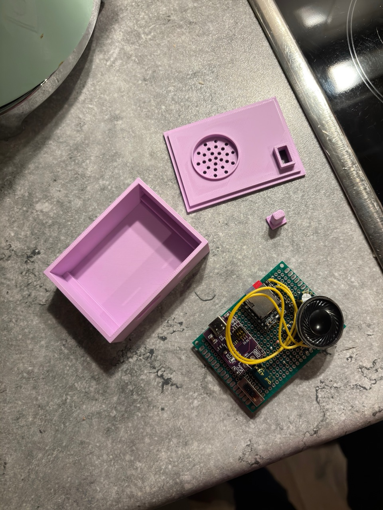

# DIY Baby Sound Machine

A compact, USB-C powered baby sound machine that plays soothing sounds on continuous loop. Perfect for nurseries - no more changing batteries!



## Features

- 🔌 USB-C powered for 24/7 operation
- Automatic loop playback of all tracks
- Built-in speaker with grille design
- Power switch for easy control
- Compact 3D-printable enclosure

## Components Needed

### Electronics
- RP2040 Zero microcontroller
- YX5200 (DFPlayer Mini) MP3 module
- 8Ω 1W speaker
- MicroSD card
- USB-C power supply
- Power switch
- Connecting wires

### 3D Printed Parts
- Main enclosure box
- Top lid with speaker grille
- Power button

**3D Print Files:** Available on [MakerWorld](your-link-here) (In review, not published yet)

## Assembly

1. **Print the enclosure** - Use standard PLA, 0.2mm layer height, 15-20% infill
2. **Wire the components** according to the wiring diagram below
3. **Flash the Arduino code** to the RP2040 Zero
4. **Load MP3 files** onto the MicroSD card (in `/mp3` folder, numbered 0001.mp3, 0002.mp3, etc.)
5. **Assemble** - Place electronics in enclosure and snap on the lid

## Wiring Diagram

```
RP2040 Zero        YX5200 Module
-----------        -------------
GPIO 4 (RX)   -->  TX
GPIO 5 (TX)   -->  RX
3.3V          -->  VCC
GND           -->  GND

YX5200 Module      Speaker
-------------      -------
SPK_1         -->  Speaker +
SPK_2         -->  Speaker -
```

## Software Setup

### Requirements
- Arduino IDE
- Board: RP2040 Zero support
- Libraries:
  - DFRobotDFPlayerMini
  - Adafruit_NeoPixel

### Installation

1. Install the required libraries via Arduino Library Manager
2. Open `baby_sound_machine.ino`
3. Select **Waveshare RP2040 Zero** as your board
4. Upload the code

### Preparing Audio Files

1. Format MicroSD card as FAT32
2. Create a folder named `mp3` on the root
3. Name your files: `0001.mp3`, `0002.mp3`, `0003.mp3`, etc.
4. Supported formats: MP3 files, 8-320 kbps

## Usage

1. Insert MicroSD card with MP3 files
2. Connect USB-C power
3. Switch power on
4. Device automatically starts playing and loops all tracks 🔄

## Configuration

Adjust volume in the code (line ~60):
```cpp
myDFPlayer.volume(15);  // 0-30, default is 15
```

## Troubleshooting

**Not playing:**
- Check SD card is properly inserted
- Verify MP3 files are in `/mp3` folder and named correctly (0001.mp3, 0002.mp3, etc.)
- Try reformatting SD card as FAT32

**No sound:**
- Check speaker connections
- Verify volume setting in code
- Check serial monitor for error messages

**Device not powering on:**
- Verify USB-C cable and power supply
- Check power switch connection

## License

This project is open source. Feel free to modify and share!

## Credits

- Inspired by commercial baby sound machines
- Built with love for better baby sleep

## Contributing

Contributions are welcome! Feel free to open issues or submit pull requests.

---

Made with 💙 for tired parents everywhere
